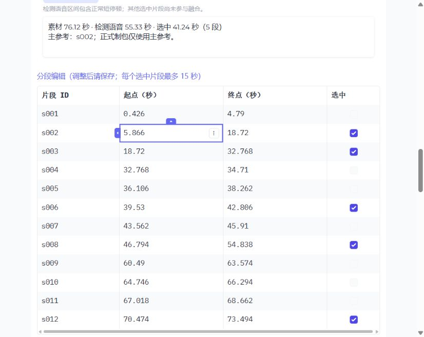
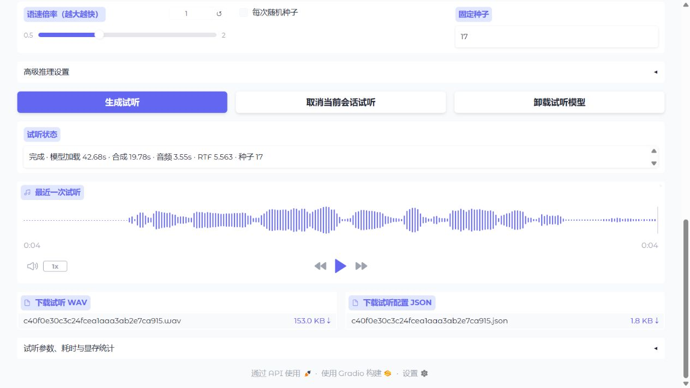

# 长素材工具与身份融合实验

本轮分开交付素材整理、现有单段制包和多段身份融合实验。融合不更新模型参数，不进入正式制包默认流程，不以辅助指标替代用户对本人相似度、清晰度、停顿和稳定性的试听判断。

交付范围与当前证据逐项见 [分层交付核对](completion-audit.md)。[产物复核](artifact-audit.json) 重新读取了实际张量、原始及匿名音频、两档正式包和 reader 模型文件，不只依赖历史成功标记；质量门槛仍明确记录为未通过。

## 素材工具

独立入口 `python voice-producer/start.py`，或统一入口 `python -m indextts.validation_web --modules producer,audition`。依赖安装及固定资产准备见 [音色工具说明](../../../voice-producer/README.md)。Silero VAD 锁定 [官方 v6.0](https://github.com/snakers4/silero-vad/releases/tag/v6.0)，CPU 按需加载，ONNX SHA-256 为 `597d30b3ec076608d059477bb14cfeffdf951bf5cae370d38f65d33bbfe82004`。系统 FFmpeg 优先，否则使用固定 `imageio-ffmpeg==0.6.0` 自带二进制。

1. 在“长视频／录音素材整理”上传本地视频或长音频，导入后查看完整音轨和自动分段。
2. 播放片段，直接编辑起止秒数、拆分／合并，取消其他人声或污染片段的选择。VAD 不做说话人识别、ASR、降噪或人声分离。
3. 选择主参考并保存。所有选中片段必须不重叠且不超过 15 秒；超长合并允许编辑，但生成前必须拆分。正常短停顿保留。
4. 人工确认同一人物，填写新音色 ID、名称及精度，使用主参考制包。其他片段当前不参与正式条件构建。音色条目保存固定裁剪参考和 `referenceSelection`，两档精度从同一来源分别生成。
5. 在试听页选择对应精度的已有裁剪模型，生成对照声音并下载。修改已用于制包的选择须创建新音色条目；补生成旧条目继续使用它的固定参考。

`MaterialService` 只负责导入、分段、编辑、裁剪及选择快照，不依赖制包／试听模型。应用层先冻结并校验选择、裁剪主参考，再调用现有制包服务；成功校验后安装到音色库。原单文件 `build`、旧 IVP schema v1/v2 和六张量 ABI 保持不变。纯情感和纯试听模式不主动加载素材模块，VAD 模型只在导入时初始化。

数据位于忽略 Git 的工作区 `materials/<sourceId>/`，包括原文件、22.05kHz 回放音轨、16kHz 检测输入及分段 JSON；音色库仍在 `voices/`。服务重启后重新选择素材即可恢复。并发页面编辑使用选择版本检查，旧页面不能覆盖新选择；失败不安装半成品。没有增加数据库或后台框架。

## 实验复现

首轮源素材为 BV1GARFBXEwe 的现有录音，文件长 76.115 秒。自动检测语音区间合计 55.328 秒（含短停顿），产生 12 段。人工确认的训练片段、留出片段及 0–15 秒空白对照均为同一人物。

| 用途 | ID | 起点／终点（秒） |
| --- | --- | --- |
| 主参考、训练 1 | s002 | 5.866 / 18.720 |
| 训练 2 | s003 | 18.720 / 32.768 |
| 训练 3 | s006 | 39.530 / 42.806 |
| 训练 4 | s008 | 46.794 / 54.838 |
| 训练 5 | s012 | 70.474 / 73.494 |
| 留出 1 | s009 | 60.490 / 63.574 |
| 留出 2 | s011 | 67.018 / 68.662 |

先通过页面导入，获得本机素材 ID，再运行：

```powershell
$env:PYTHONUTF8 = '1'
.venv/Scripts/python.exe tools/reference_fusion_experiment.py prepare --material-id YOUR_MATERIAL_ID --segments s002,s003,s006,s008,s012 --held-out s009,s011 --primary s002 --confirmed-target --confirmed-pause-target --source-model-dir voice-producer/models/checkpoints --reader-model-dir YOUR_FP32_READER_MODELS --output outputs/reference-fusion-YOUR_RUN
.venv/Scripts/python.exe tools/reference_fusion_experiment.py run --output outputs/reference-fusion-YOUR_RUN
```

`prepare` 拒绝已有输出目录。两个确认参数只能在人工检查对应片段／整个空白对照区间后使用。若无符合条件的内部长空白，对照记为不适用；不制造空白。素材 ID、自动分段会因新导入产生不同记录，应对照上表核验边界，不盲用 ID。模型路径由本机指定，不依赖交接目录或自动导出。

首轮 FP32、基础情感、语速 1.0；四段文本、种子 17/29、beam 3、关闭 GPT 采样、重复惩罚 10、长度惩罚 0、最大 token 1500、声学 25 步和 CFG 0.7 固化在脚本及配置中。两个短文本复用先前实验，另两段覆盖长句、时间数字及多处标点。每组八个样本，共七组：单段主参考、原始向量均值三／五段、归一化后均值三／五段、保留／缩短空白。

融合仅修改 `speaker_style`，通过原说话人投影重新计算 `speaker_latent`；主参考 `prompt_condition`、`ref_mel`、`base_emotion`、`emotion_basis` 逐张量保持相同。归一化候选为 `mean(style / norm(style)) * mean(norm(style))`，不会再归一化所得均值，也不平均其他条件张量。编码按片段串行执行，输入均不超过 15 秒。

空白 A/B 使用同一个 0–15 秒区间，将 VAD 判定的内部空白 ≥500ms 缩短至 200ms；语音采样点保持相同。该实验重新编码各自参考，不能把变化直接归因于某一个条件张量，也不能先认定长空白导致异常停顿。

`run` 将编码、各组合成及指标计算分别放在隔离进程；异常／超时和原生退出码写入 `isolated-runs.json`，不污染正式音色库。失败后可针对已修复的阶段重跑 `encode`、`synthesize --case CASE` 或 `summarize`，成功后再生成完整报告；不要将部分样本视为成功对照。正常结果包括 `configuration.json`、编码张量、每组 WAV/报告、`results.json`、匿名 `blind/` 音频和私有 `blind-key.json`。

辅助相似度用 CAMPPlus 对两个留出片段的平均余弦值，跨文本一致性在相同种子内计算。它与条件编码器同属一个模型体系，不是独立音质指标；生成音频取前 15 秒提取辅助表示。内部静音采用 20ms RMS、阈值 max(0.001, 峰值 RMS 的 3%)、只计首尾发声之间 ≥100ms 的间隔；这不能验证逐字发音正确。有效输出检查有限数值、长度及非纯静音，主观清晰度仍由人听。

匿名样本只降低音量以匹配同一问题、文本／种子组内最低 RMS，原始 WAV 不改动。身份对照 `identity-seed-*-text-*.wav` 按 V01–V05 顺序，空白对照 `pause-seed-*-text-*.wav` 按 P01–P02 顺序，两类分开判断，中间留 1 秒；时间索引写入同名 JSON。某一类完整合成后可用 `blind` 阶段先生成该类试听，不将另一类的部分输出作为完整技术报告。先听再揭示映射。正式多段制包仅在技术检查与用户试听确认候选收益后接入版本化条件方法及 schema v3 来源校验；当前没有该正式入口，也没有宣称提升音质。

## 本机验证与结论

本机使用 Windows、Python 3.11.13、Torch 2.8.0+cu128、Gradio 5.45.0、ONNX Runtime 1.23.2、RTX 2060。资料及实验成果不设某型号显卡的速度门槛。

- 素材工具：真实录音导入、编辑、拆分、合并、片段播放及服务重启恢复已验证；真实视频、44.1kHz 立体声、静音、损坏媒体、损坏 VAD 的导入与恢复已验证。独立导入过程未导入 PyTorch 或制包模型。浏览器从人工修改后的 5.866–18.700 秒主参考成功生成 FP32 包（CPU，含首次加载 74.922 秒），随后补生成 BF16 包（CUDA，含首次加载 38.692 秒），两份下载包哈希均一致。显式 BF16 CPU 请求报错，原 FP32 保留，随后 CUDA 重试成功；测试资产位于单独 QA 工作区。
- 回归：162 项通过，覆盖原 API、旧包、两档精度、取消恢复、GPU 切换、选择快照、失败保留、模块启动隔离及素材边界；`uv lock --check --offline` 通过。初跑两个页面构造子进程超时，测量工具排除可选联网 analytics 后六种启动模式及完整回归通过；测试记录保留最终成功结果。
- 多段方案：七组、每组八个样本，共 56 个输出全部完成，九个隔离阶段退出码均为 0。输出有限、非纯静音，逐文件 SHA-256 及完整参数、资源记录见 [实验结果](experiment-results.json)。非身份张量保持一致，来源模型及参考编码器指纹与既有路径一致。
- 用户试听结论：首轮偏好 V05（归一化五段融合）和 P02（保留空白）；后续种子 29 反馈为短句更像本人、长句更自然，用户明确该描述针对两条文本音频，不是 V04/V05 的偏好反转。尚未确认融合在相似度、清晰度、停顿和稳定性上的整体收益。用户发现主参考 s002 混有 BGM，因此首轮“干净主参考”的假设不能成立；当前是含污染素材的探索对照，不能作为干净参考条件下的最终质量验收。不将初步偏好当作正式融合批准。

历史 15／30／45 秒实验只作背景：该素材的 30 秒辅助相似度曾高于 15 秒，45 秒未进一步提升；完整长输入曾原生崩溃。它不能证明普适最佳时长或崩溃原因。本轮不将完整长音频再次送入编码器。

### 单素材技术观察

| 组别 | 留出片段辅助余弦均值 | 同种子跨文本余弦均值 | 平均内部静音（秒） | 最长内部静音（秒） |
| --- | ---: | ---: | ---: | ---: |
| 单段主参考 | 0.4083 | 0.8659 | 1.108 | 0.70 |
| 原始表示均值，三段 | 0.4398 | 0.8727 | 1.233 | 0.94 |
| 原始表示均值，五段 | 0.4439 | 0.8785 | 1.585 | 1.04 |
| 归一化后均值，三段 | 0.4419 | 0.8627 | 1.480 | 1.22 |
| 归一化后均值，五段 | 0.4845 | 0.8856 | 1.475 | 1.06 |
| 空白保留 | 0.4029 | 0.9003 | 0.630 | 0.64 |
| 空白缩短 | 0.3955 | 0.8861 | 0.555 | 0.62 |

融合组的辅助相似度上升，但内部静音也增加。该证据不足以确认整体收益或“更像本人”，不据此选择正式方法。空白缩短组平均内部静音仅减少 0.075 秒，辅助相似度与一致性略降；两组部分输出接近满幅的采样点比例最高分别为 0.62% 和 0.99%，仍须人工判断失真、清晰度与停顿。不能据此宣称长空白就是异常停顿原因。

实验模型加载 30.93–43.14 秒，合成 RTF 3.86–26.42。长时间串行运行期间笔记本温度、功耗与系统负载变化较大，这些是本机观测范围，不能用于融合方案的公平速度排名。合成子进程 PyTorch 峰值 allocated 最高 3955.1 MiB、reserved 最高 5184 MiB；RSS 最高 2920.2 MiB。PyTorch 统计不含其他进程、WDDM 或整机内存。

匿名对照的时间分界保存在 [试听索引](blind-timings.json)，映射留在本地 `blind-key.json`，等待用户先听后判断。当前结论为“技术流程可执行，质量收益尚未确认”，正式多段方法及 schema v3 尚未启用。

首轮反馈后揭示映射：V01 原始三段、V02 原始五段、V03 归一化三段、V04 单段基线、V05 归一化五段；P01 缩短空白、P02 保留空白。种子 29 的另外两条文本追加了 V04→V05 的成对试听。用户偏好保留空白，正式素材工具继续保留片段内正常停顿，不添加自动空白压缩。

### 两档正式单段包的浏览器试听

两份包均由相同固定主参考生成，仍为 schema v2，没有 dtype 转换。分别使用既有 FP32/BF16 裁剪模型，加载前沿用包精度与模型指纹校验；真实生成、播放、WAV 下载及哈希核验通过。重启后 FP32 最近试听保留。详细包 provenance、六张量 dtype、模型 manifest 哈希、完整参数及显存口径见 [浏览器端到端记录](browser-end-to-end.json)。

| 精度 | 模型加载（秒） | 实际合成（秒） | 音频（秒） | RTF |
| --- | ---: | ---: | ---: | ---: |
| FP32 | 46.95 | 17.87 | 3.785 | 4.720 |
| BF16 | 42.68 | 19.78 | 3.553 | 5.563 |

两档默认生成策略保持原设置，试听用于功能验证，不能单独归因于 dtype 或声明某精度音质更好。浏览器发现 `producer,audition` 模式的空情感 State 被渲染为重复试听页签，已移动到页签内部，刷新后仅两个正确页签。新增布局回归和素材／匿名对照测试：39 项通过，布局测试曾因测试脚本访问根 Blocks ID 失败，修正后该项单独通过（1 项）；完整基础回归 162 项记录保持不变，未声称新增修改后重跑全部 162 项。




源码、资产锁、输入片段／参数指纹和验证摘要进入 Git。模型、原始素材、上传缓存、实验张量及音频全部留在本地忽略目录；主仓库及交接目录未修改，不推送。
