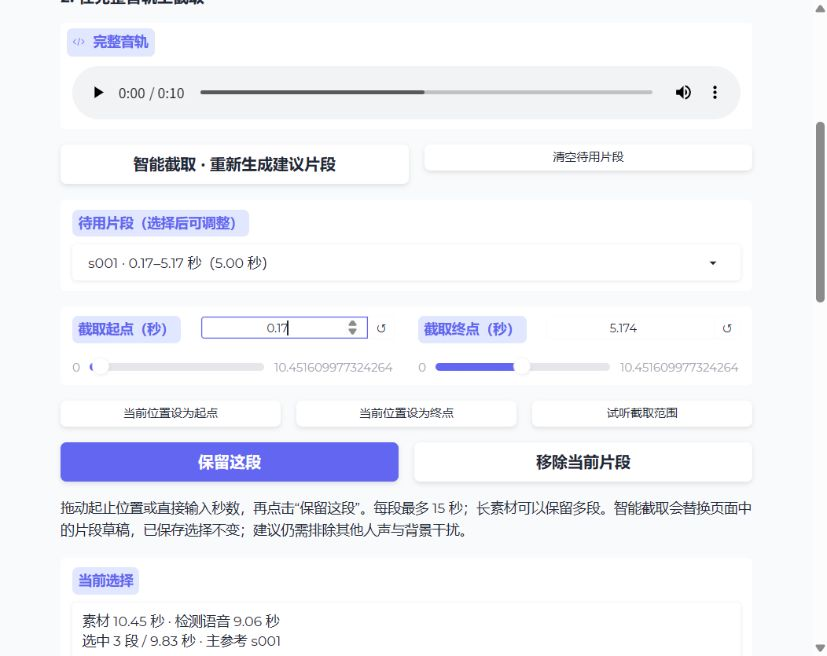

# 主音轨与手动截取验证（2026-10-03）

素材区改为一条完整音轨播放器，保留原有素材格式、选择快照及制包行为。起止滑条和秒数输入用于编辑边界；当前位置可写入边界；截取试听在同一播放器内定位、播放并停在终点。待用片段支持新增、调整和移除，其他批量编辑仍在折叠区域。

上传仍自动提供 Silero VAD 初稿。“智能截取”可重新生成建议，“清空待用片段”可改为完全手动截取。这些操作只改页面草稿；生成时才保存选择。建议不识别说话人、不消除背景干扰，每段仍须不超过 15 秒。

## 自动验证

```powershell
.venv/Scripts/python.exe -m pytest tests/test_materials.py tests/test_validation_decoupling.py -q
```

结果：52 passed，72.44 秒；仅有既存 websockets 弃用警告。覆盖手动边界校验、重叠、超长、非有限数值、排除记录保留、未保留范围阻止生成、智能建议不覆盖已保存选择，以及原有素材快照、失败恢复、功能隔离与跨页连接。

## 本机浏览器验证

使用统一入口 `python -m indextts.validation_web --port 7861`，通过现有本地素材操作：

| 操作 | 结果 |
| --- | --- |
| 恢复短音轨 | 完整播放器载入 10.45 秒音轨，原 3 段及主参考恢复 |
| 恢复长音轨 | 原 561.15 秒音轨、4 个待用片段及主参考恢复 |
| 截取试听 | 232–232.8 秒范围在主播放器播放，最后 `paused=true`、`currentTime=232.8` |
| 当前播放位置设为终点 | 秒数输入变为 232.8 |
| 清空与新增 | 清空后保留 231.5–242.5 秒，新增 1 段、11 秒 |
| 调整已有片段 | 终点改为 242 秒并保留，ID 不变、时长变为 10.5 秒 |
| 移除当前片段 | 待用片段归零，历史记录仅在页面中标为排除 |
| 智能建议 | 长音轨得到 133 段、选中时长 215.07 秒；检测语音时长 175.17 秒。含边界余量，选中时长不等于有效语音时长 |

浏览器草稿操作前后，原长素材 `material.json` 的 SHA-256 均为 `fc13c3329650de5ea6341b6c27b5b826ad1f7acc405f739ec2dbaf8f9d18b99e`。没有在原素材上提交测试制包或覆盖其选择记录。验证后丢弃实验草稿，页面恢复用户原短音轨。现有音色库未修改。



本轮未改变模型、包格式、融合算法或推理参数，也未重复 GPU 音质、性能实验。制包路径沿用上一轮验证；本记录验证的是素材操作与生成前选择校验。
