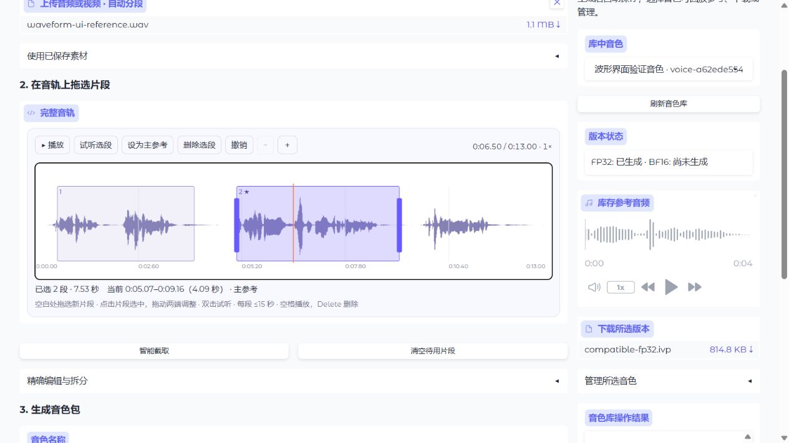
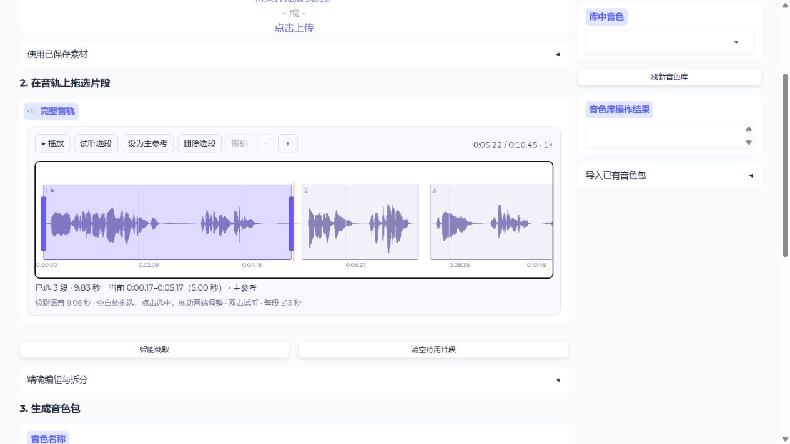

# 波形拖选验证（2026-10-03）

本轮把独立播放器、片段下拉、两条起止滑条及保留按钮合并为图形音轨。前端直接拖选多个片段、调整两端、移动整段；同一工具条负责播放、选段试听、主参考、删除、撤销和缩放。智能建议绘制在相同音轨上，精确秒数表格与拆分操作折叠保留。

没有新增前端库、CDN 或依赖。CPU 流式生成最多 12,000 组最小／最大峰值并保存到忽略 Git 的素材目录，浏览器 SVG 仅绘制可见范围；参考编码仍使用原始采样。服务、素材格式、音色包 ABI、融合和推理行为不变。

## 自动验证

```powershell
.venv/Scripts/python.exe -m pytest tests/test_materials.py tests/test_validation_decoupling.py -q
```

58 passed，118.13 秒，只有既存 websockets 弃用警告。覆盖图形草稿作为制包输入、延迟表格同步不改变生成范围、跨素材草稿拒绝、无效数值拒绝、峰值缓存有界且不改采样、损坏缓存重建，以及现有快照、失败重试、模型隔离和跨页行为。

## 浏览器与真实制包

- 恢复 10.45 秒音轨，原 3 段及主参考绘制正常。在清空草稿后，连续拖选两段，选中数量正确从 1 增至 2，隐藏输入与画出的边界一致。
- 拖动色块移动整段；拖动右边界时起点保持 5.745 秒，终点从 7.489 调整至 7.203 秒。指定主参考、试听、删除、撤销均正常；试听结束时播放器暂停在所选终点附近（原生时间精度为微秒级）。
- 恢复 561.15 秒长音轨，原 4 段和主参考恢复。8 倍放大显示局部真实波形，横向移动可定位至音轨末尾。智能截取绘制 133 段、共 215.07 秒的建议草稿，不写回原选择记录。
- 全长视图拖出超过 15 秒的范围会显示原因并保留原草稿；随后拖出 9.363 秒片段可正常纳入选择。再次清空成功归零，重复命令不会因底层 HTML 原值相同而失效。
- 新建独立验证素材：从已确认同一目标人物的原素材裁出 231–244 秒，页面上传、FFmpeg 解码、自动建议和波形均成功。手动拖选 **0.561–4.001** 与 **5.070–9.160** 秒两段后提交 FP32 真实制包，主参考为第二段。
- 页面成功产出等权身份融合包；provenance 的两段范围、片段哈希与主参考均与图形提交一致。制包总耗时 61.89 秒，包含本次首次模型加载，不能当作纯编码性能。
- 浏览器下载成功，下载包与库内包 SHA-256 相同：`dcde27ff655d0c63f22d19c500c93f2170903cafb06fde9fde3715f5f11dd026`。

验证包、验证素材及下载副本已移动到本地 `.trash/material-waveform-20261003/`，不混入日常音色库。原长素材选择记录 SHA-256 仍为 `fc13c3329650de5ea6341b6c27b5b826ad1f7acc405f739ec2dbaf8f9d18b99e`，原短素材和现有成品包未修改。未对本轮验证包进行主观质量验收。




