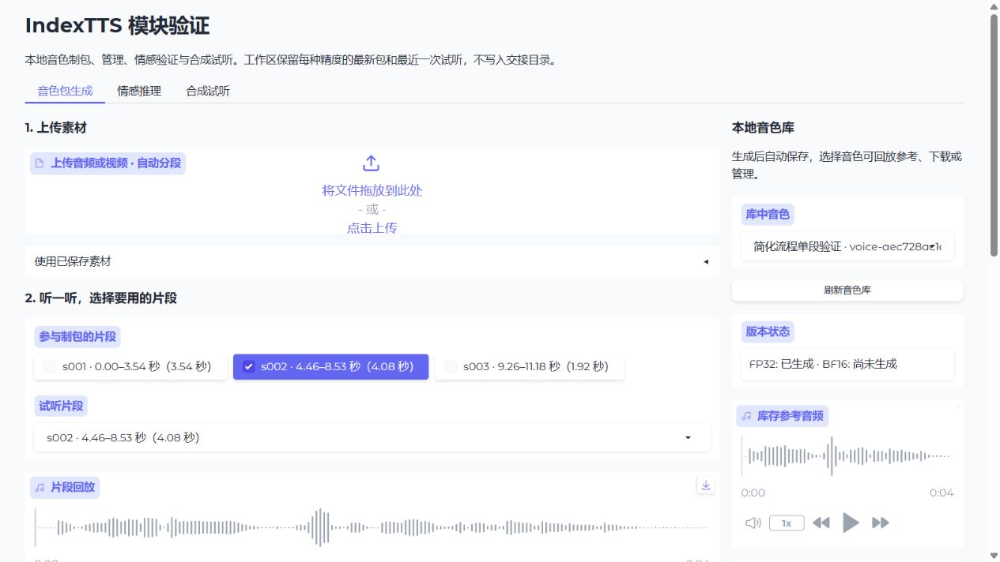
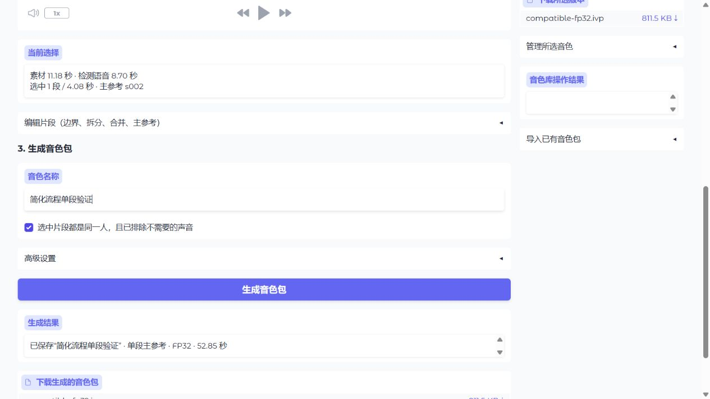

# 制包页面简化验证（2026-10-02）

制包主流程合并为：上传音频或视频后自动分段 → 回放并勾选片段 → 填名称、确认人物并生成。统一入口与独立制包入口复用相同页面。

- 自动分配新音色 ID；默认 FP32、自动设备。生成时保存片段选择，不再要求额外点击保存。
- 默认一段使用单段主参考，多段使用身份等权融合；生成结果显示实际方法。高级设置仍可指定方法、BF16、设备和性别。融合不是已证明的普适音质提升。
- 边界、拆分、合并、主参考与完整音轨折叠到“编辑片段”；长片段必须拆分。片段列表限高滚动，避免长素材撑长整个页面。
- 音色库放在旁边，选择后才展开参考回放、下载与管理；版本补生成、备注、导入、确认删除均保留。模型固定目录、指纹、完整报告和包检查折叠到“诊断与模型”。
- 未修改制包编码、包格式、音色库格式、原单文件 API、CLI 或试听参数。原有本地资产无需迁移。

## 自动与手动的边界

VAD 只负责分段，不判断人物、背景音乐或音质。主参考默认按最长选中片段建议，保存素材会恢复此前的主参考；可在编辑区改为自动或指定其他选中片段。用户仍需听片段并确认同一人物。构建方法可以手动覆盖，成品是否可接受需试听判断。

提交时冻结选择和生成设置；后续修改页面不会改变已提交请求。先返回保存后的 revision 再执行编码，模型失败后可直接重试；其他会话已修改素材时拒绝保存，要求重新载入。成功后从包 manifest 定位库中音色，避免把 Gradio 下载缓存目录误当音色 ID。

## 本机验证

测试命令：

```powershell
.venv/Scripts/python.exe -m pytest tests/test_materials.py tests/test_voice_workbench.py tests/test_reference_selection_v3.py -q
.venv/Scripts/python.exe -m pytest tests/test_validation_decoupling.py -q
```

分别 **52 与 24 项通过，共 76 项**。覆盖自动单段／融合选择、取消主参考后推荐、未确认／超长／不足片段拒绝、失败重试、请求快照、其他会话冲突、原音色库行为、schema v3 校验、六种模块启动组合、延迟加载、固定目录及跨页导航。仅有现有依赖的弃用提示。

真实浏览器操作使用已确认的 BV1RYEc65EYg 主参考副本（11.18 秒），独立导入为测试素材；没有修改原长素材的选择记录。

| 验证 | 结果 |
| --- | --- |
| 上传后自动分段 | 三段：0–3.542、4.458–8.534、9.258–11.18 秒；片段播放器加载波形及播放控制 |
| 三段、自动方法、FP32／自动设备 | 等权融合，schema v3；58.09 秒，含首次模型加载及校验 |
| 服务重启 | 已保存素材可恢复；不会在页面构造时自动选择素材或加载模型 |
| 改为只选择 s002 后生成 | 单段主参考，schema v2；52.85 秒，含重启后的首次模型加载及校验 |
| 音色库自动选中 | 使用实际包 ID，显示 FP32 已生成、BF16 尚未生成，参考回放与下载正常 |
| 下载 | 浏览器下载 `.ivp`；重新用现有加载器检查通过，哈希见 assets.json |
| 原有音色 | 两档版本保留，可继续选择及管理 |

上述耗时是制包端到端耗时，不是 TTS 合成 RTF。本轮没有重新运行 BF16 真实制包或进行新的主观音质验收；两档管理与旧接口沿用已验证实现。

测试音色、导入副本及下载包移至被 Git 忽略的本地 `.trash/producer-workflow-20261002/`，不留在日常列表。原模型、长素材、已有音色与交接目录保持原状。必要包／素材／模型指纹保存在 [assets.json](assets.json)，不提交模型或音频。





## 启动

仅制包：`.venv/Scripts/python.exe voice-producer/start.py`（默认 7862）。统一入口：`.venv/Scripts/python.exe -m indextts.validation_web --port 7861`。跨设备权重准备仍按 [音色工具说明](../../../voice-producer/README.md) 的固定目录与资产锁执行；选择一个入口运行，复用现有本机音色库。
